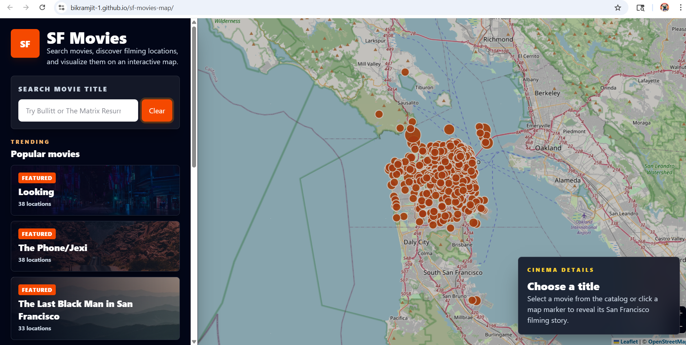
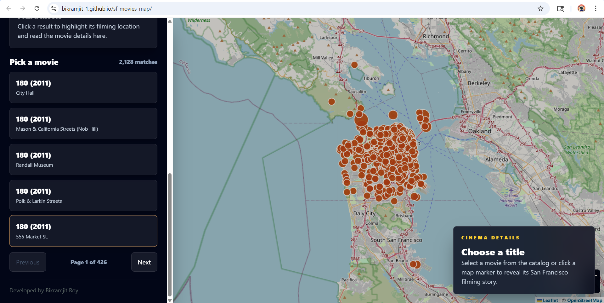

# 🎬 SF Movies

A React-based web application that visualizes movie filming locations in San Francisco on an interactive map. Users can search movies using autocomplete and explore real filming spots across the city.

🌐 **Live App:** https://bikramjit-1.github.io/sf-movies-map/  
🎥 **Demo Video:** https://drive.google.com/file/d/13kCzih_xPG4nQSgIshi5yaMYMT-H5fki/view?usp=sharing

---

## 📌 Features

- 🗺️ Interactive San Francisco map using Leaflet and OpenStreetMap
- 🔍 Autocomplete search by movie title
- 🎥 Explore real filming locations
- 📍 Map markers grouped by shared coordinates
- 📊 Movie details (cast, production, locations)
- ⚡ Live data fetching (no backend required)
- 🎯 Smooth map navigation (fly-to location)

---

## 📸 Screenshots

### 🏠 Main View


### 🔍 Search & Results


---

## 📊 Data Source

This project uses the official **DataSF Film Locations dataset**:

- Dataset Page:  
  https://data.sfgov.org/Culture-and-Recreation/Film-Locations-in-San-Francisco/yitu-d5am/about_data

- API Endpoint:  
  https://data.sfgov.org/resource/yitu-d5am.json

The dataset includes latitude and longitude, enabling accurate map visualization.

---

## 🛠️ Tech Stack

- **Frontend:** React
- **Maps:** Leaflet
- **Tiles:** OpenStreetMap
- **Data Source:** DataSF Public API
- **Styling:** Tailwindcss

---

## 📂 Project Structure

```text
src/
  App.jsx
  main.jsx
  styles.css
  components/
    FilmMap.jsx
    Header.jsx
    MovieCard.jsx
    ResultsList.jsx
    SearchBox.jsx
    Stat.jsx
    StatsPanel.jsx
    StatusMessage.jsx
  constants/
    map.js
  hooks/
    useFilmLocations.js
  utils/
    dataSf.js
    mapGroups.js
    popup.js
    search.js
```

## ⚙️ Installation & Setup

Make sure you have Node.js installed.

```bash
npm install
npm run dev
```

Open the local development URL shown in the terminal.

## 🏗️ Build

```bash
npm run build
```

## 🖥️ How to Use

1. Open the app
2. Search for a movie using the search bar
3. Select a movie from suggestions
4. View filming locations on the map
5. Click markers to see details
6. Explore San Francisco filming spots

## 🌐 Deployment

Deployed using GitHub Pages.

## 👨‍💻 Developer

Name: Bikramjit Roy
Role: Software Engineer

Experience:
- 3.6+ years in Software Development

Skills:
- React / Next.js / React Native
- TypeScript / JavaScript
- React Query
- CouchDB / MySQL


GitHub: https://github.com/bikramjit-1

LinkedIn: https://www.linkedin.com/in/bikramjit-roy/

## 📄 License

This project is created for assessment and demonstration purposes.

## 🙌 Acknowledgements

Data provided by the City and County of San Francisco (DataSF)  
OpenStreetMap contributors  
Leaflet for interactive maps
